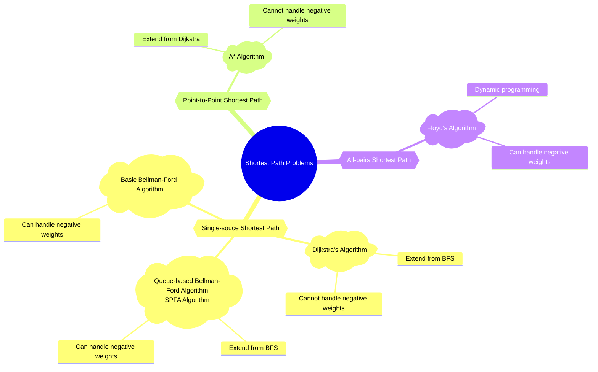

## 🧠 Concept

- Usually, the shortest path refers to the **minimal sum of path weights** for weighted graph

- **Single-source** shortest path

  - Find the shortest path from one starting point to **all other nodes**
  - The output of a single-source shortest path algorithm is usually a **one-dimensional array `distTo`**, where `distTo[i]` means the shortest path length from the start node to node `i`

- **Point-to-point** shortest path

  - Find the shortest path from a start node `src` to a target node `dst`
  - A special case of the single-source shortest path problem, stopped when reach `dst`, or
  - A^\*^ Algorithm

- **All pairs** shortest path
  - Find the shortest paths **between any two nodes** in a graph
  - The final output of an all-pairs shortest path algorithm is a **2D array `dist`**, where `dist[i][j]` means the shortest path length from node `i` to node `j`
  - Sometimes, using **Floyd** is more efficient. Sometimes, running **Dijkstra multiple times** is better.
